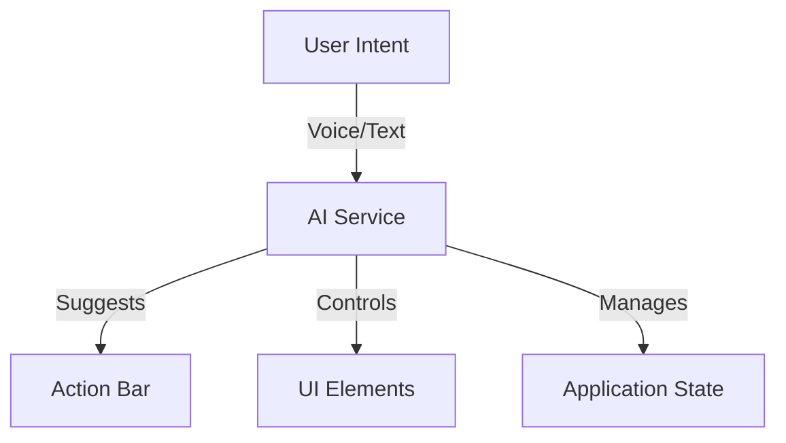

# Serra Architecture

## AI-Driven Interface

Serra represents a departure from traditional UI paradigms:

### Traditional UI
- Static menus and buttons
- Fixed interaction patterns
- Predictable but inflexible
- Direct manipulation

### Serra's AI Interface
- Dynamic action suggestions
- Context-aware interactions
- Adaptive UI elements
- Intent-based interaction

## Core Components



### Intent Processing
1. User expresses intent (voice/text)
2. AI interprets and suggests actions
3. UI updates to match context
4. Actions execute based on intent

### Benefits
- More natural interaction
- Reduced UI complexity
- Contextual assistance
- Progressive disclosure
- Unified voice/text interface

## System Overview

Serra is a reactive computation system built around a core engine that manages bidirectional data flow and formula computations. The system follows several key architectural patterns to maintain flexibility, scalability, and maintainability.

## Core Architecture Components

### Engine

The Engine is the central orchestrator of the Serra system. It manages:

- Dashboard lifecycle and state management
- Formula registration and execution
- Element creation and disposal
- Computation scheduling and optimization

```javascript
const engine = new Engine();
engine.createDashboard('main');
engine.setCurrentDashboard('main');
```

### Dashboard Factory

The Dashboard implements the Factory pattern for creating elements:

- Standardizes element creation
- Manages element relationships
- Handles element lifecycle
- Maintains element registry

```javascript
const dashboard = engine.createDashboard('analytics');
const numberElement = dashboard.createElement('Revenue', 'number');
const formulaElement = engine.createFormula('Profit=Revenue-Costs');
```

### Reactive Computation Network

The computation network is built on these principles:

1. **Directed Graph Structure**
   - Elements are nodes
   - Formulas define edges
   - Supports cyclic relationships

2. **Smart Propagation**
   - Efficient change detection
   - Minimal recomputation
   - Automatic dependency tracking

3. **Bidirectional Flow**
   - Changes can flow in multiple directions
   - Automatic conflict resolution
   - Circular dependency handling

## Architecture Separation

The project is designed with a clear separation of concerns across three distinct layers:

### 1. Platform-Agnostic Core (`core/`)
- Engine and computation system
- Element models and interfaces
- Communication protocols
- No dependencies on DOM, browser APIs, or UI frameworks
- Services that work in any JavaScript environment

### 2. Server (`server/`)
- Node.js/Express server implementation 
- API endpoints and authentication
- Server-specific extensions of core services
- No DOM dependencies

### 3. Client (`client/`)
- DOM-dependent code
- Browser-specific implementations
- React components and UI
- Platform-specific adapters for core services

This separation ensures:
- Maximum code reuse
- Clean testing through dependency isolation
- Support for different environments
- Consistent programming model

## Design Patterns

### Factory Pattern

Used for element creation to ensure:

- Consistent initialization
- Proper registration
- Type safety
- Resource management

### Observer Pattern

Implemented for change notification:

- Value changes trigger updates
- Formula recomputation
- UI synchronization

### Command Pattern

Used in the CLI and API layer:

- Standardized operations
- Undo/Redo support
- Operation logging

### Adapter Pattern

Used to connect platform-specific code with core:

- Consistent interfaces
- Dependency inversion
- Platform isolation

## Component Interactions

### Element Lifecycle

1. **Creation**
   ```javascript
   const element = dashboard.createElement('name', 'type');
   ```

2. **Registration**
   - Added to dashboard registry
   - Initialized with default values
   - Setup change listeners

3. **Usage**
   - Participates in formulas
   - Receives/triggers updates
   - Maintains relationships

4. **Disposal**
   ```javascript
   element.dispose();
   ```
   - Cleanup resources
   - Remove from registry
   - Break relationships

### Formula System

1. **Definition**
   ```javascript
   const formula = engine.createFormula('Y=X*2');
   ```

2. **Computation Setup**
   ```javascript
   formula.addComputations({
     Y: {
       inputs: ['X'],
       compute: '(X) => X * 2'
     }
   });
   ```

3. **Execution**
   - Triggered by input changes
   - Follows dependency graph
   - Updates affected elements

## Communication Layer

The communication layer uses several services:

1. **SocketService**
   - Provides real-time communication
   - Abstracts transport mechanism
   - Works in both client and server

2. **WebRTCService**
   - Enables peer-to-peer communication
   - Reduces server load for direct data exchange
   - Can work without central server (decentralized)

3. **ConnectionStatusService**
   - Manages connection state across transports
   - Fallback mechanisms between transports
   - Unified status reporting

## Best Practices

### Element Management

1. **Creation**
   - Use dashboard factory methods
   - Provide clear, unique names
   - Set appropriate types

2. **Relationships**
   - Define clear dependencies
   - Avoid unnecessary coupling
   - Use meaningful formulas

3. **Cleanup**
   - Properly dispose elements
   - Remove unused formulas
   - Clear relationships

### Formula Design

1. **Computation Logic**
   - Keep formulas simple
   - Split complex calculations
   - Consider bidirectional flow

2. **Performance**
   - Minimize dependencies
   - Optimize calculations
   - Use appropriate types

3. **Maintenance**
   - Document relationships
   - Use clear naming
   - Test edge cases

## Error Handling

### Common Scenarios

1. **Circular Dependencies**
   - Detected automatically
   - Resolved through priorities
   - Logged for debugging

2. **Type Mismatches**
   - Validated at creation
   - Converted when possible
   - Error on incompatible

3. **Missing Dependencies**
   - Graceful degradation
   - Clear error messages
   - Recovery options

## Performance Considerations

### Optimization Strategies

1. **Computation Scheduling**
   - Batch updates
   - Prioritize critical paths
   - Defer non-essential updates

2. **Memory Management**
   - Proper cleanup
   - Resource pooling
   - Garbage collection

3. **Network Efficiency**
   - Minimal propagation
   - Smart caching
   - Throttling/debouncing