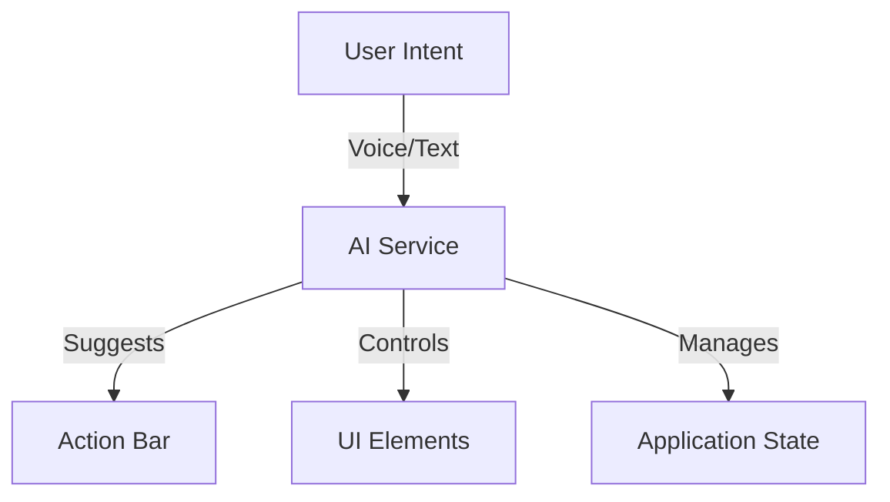

# Serra Architecture

## AI-Driven Interface

Serra represents a departure from traditional UI paradigms:

### Traditional UI
- Static menus and buttons
- Fixed interaction patterns
- Predictable but inflexible
- Direct manipulation

### Serra's AI Interface
- Dynamic action suggestions
- Context-aware interactions
- Adaptive UI elements
- Intent-based interaction

## Core Components


```mermaid
graph TD
    User[User Intent] -->|Voice/Text| AI[AI Service]
    AI -->|Suggests| Actions[Action Bar]
    AI -->|Controls| UI[UI Elements]
    AI -->|Manages| State[Application State]
```

### Intent Processing
1. User expresses intent (voice/text)
2. AI interprets and suggests actions
3. UI updates to match context
4. Actions execute based on intent

### Benefits
- More natural interaction
- Reduced UI complexity
- Contextual assistance
- Progressive disclosure
- Unified voice/text interface

## System Overview

Serra is a reactive computation system built around a core engine that manages bidirectional data flow and formula computations. The system follows several key architectural patterns to maintain flexibility, scalability, and maintainability.

## Core Architecture Components

### Engine

The Engine is the central orchestrator of the Serra system. It manages:

- Dashboard lifecycle and state management
- Formula registration and execution
- Element creation and disposal
- Computation scheduling and optimization

```javascript
const engine = new Engine();
engine.createDashboard('main');
engine.setCurrentDashboard('main');
```

### Dashboard Factory

The Dashboard implements the Factory pattern for creating elements:

- Standardizes element creation
- Manages element relationships
- Handles element lifecycle
- Maintains element registry

```javascript
const dashboard = engine.createDashboard('analytics');
const numberElement = dashboard.createElement('Revenue', 'number');
const formulaElement = engine.createFormula('Profit=Revenue-Costs');
```

### Reactive Computation Network

The computation network is built on these principles:

1. **Directed Graph Structure**
   - Elements are nodes
   - Formulas define edges
   - Supports cyclic relationships

2. **Smart Propagation**
   - Efficient change detection
   - Minimal recomputation
   - Automatic dependency tracking

3. **Bidirectional Flow**
   - Changes can flow in multiple directions
   - Automatic conflict resolution
   - Circular dependency handling

## Architecture Separation

Serra is organized as a modern JavaScript codebase using ES modules. The
intended separation is:

### 1. Platform-Agnostic Core (`core/`)

- Engine and computation model
- Element abstractions
- Formula and propagation services
- Shared command, continuation and utility layers
- No dependency on DOM, browser APIs or UI frameworks

### 2. Server (`server/`)

- Node.js/Express server implementation
- API endpoints and server-side services
- Server-side AI, auth, job and transport adapters
- No DOM dependency

### 3. Client (`client/`)

- Browser and React user interface
- DOM-dependent components and hooks
- Browser transports and client-side adapters
- Dashboard presentation and interaction surfaces

This separation is important for Serra's corpus role: it makes it possible to
discuss the reactive computation model, the operational API and the user
interface without confusing them as one layer.

## Design Patterns

### Factory Pattern

Used for element creation to ensure:

- Consistent initialization
- Proper registration
- Type safety
- Resource management

### Observer Pattern

Implemented for change notification:

- Value changes trigger updates
- Formula recomputation
- UI synchronization

### Command Pattern

Used in the CLI and API layer:

- Standardized operations
- Undo/Redo support
- Operation logging

### Adapter Pattern

Used to connect platform-specific code to the core model:

- consistent interfaces across client and server;
- dependency inversion between core abstractions and runtime transports;
- platform isolation for DOM, Node.js and network-specific concerns;
- easier testing through mockable boundaries.

## Component Interactions

### Element Lifecycle

1. **Creation**
   ```javascript
   const element = dashboard.createElement('name', 'type');
   ```

2. **Registration**
   - Added to dashboard registry
   - Initialized with default values
   - Setup change listeners

3. **Usage**
   - Participates in formulas
   - Receives/triggers updates
   - Maintains relationships

4. **Disposal**
   ```javascript
   element.dispose();
   ```
   - Cleanup resources
   - Remove from registry
   - Break relationships

### Formula System

1. **Definition**
   ```javascript
   const formula = engine.createFormula('Y=X*2');
   ```

2. **Computation Setup**
   ```javascript
   formula.addComputations({
     Y: {
       inputs: ['X'],
       compute: '(X) => X * 2'
     }
   });
   ```

3. **Execution**
   - Triggered by input changes
   - Follows dependency graph
   - Updates affected elements

## Communication Layer

The communication layer is still evolving, but it should remain a boundary
between the core computation model and runtime-specific transports.

Current and planned concerns include:

1. **Connection status**
   - Tracks transport availability
   - Gives the UI a stable view of connected, degraded or offline states
   - Avoids mixing transport details into dashboard logic

2. **Socket and gateway transports**
   - Provide real-time client/server communication
   - Keep transport selection outside the core engine
   - Prepare for browser and server implementations to diverge safely

3. **WebRTC and peer-to-peer experiments**
   - May reduce server dependency for direct exchanges
   - Must remain optional and policy-governed
   - Should not make network topology part of the public corpus by accident

4. **MCP and agent-facing gateways**
   - Are relevant to Serra's future role in Cogentia and Fractanet
   - Need public/private review before being indexed as stable public sources
   - Should expose explicit tools and citations rather than raw local state

## Best Practices

### Element Management

1. **Creation**
   - Use dashboard factory methods
   - Provide clear, unique names
   - Set appropriate types

2. **Relationships**
   - Define clear dependencies
   - Avoid unnecessary coupling
   - Use meaningful formulas

3. **Cleanup**
   - Properly dispose elements
   - Remove unused formulas
   - Clear relationships

### Formula Design

1. **Computation Logic**
   - Keep formulas simple
   - Split complex calculations
   - Consider bidirectional flow

2. **Performance**
   - Minimize dependencies
   - Optimize calculations
   - Use appropriate types

3. **Maintenance**
   - Document relationships
   - Use clear naming
   - Test edge cases

## Error Handling

### Common Scenarios

1. **Circular Dependencies**
   - Detected automatically
   - Resolved through priorities
   - Logged for debugging

2. **Type Mismatches**
   - Validated at creation
   - Converted when possible
   - Error on incompatible

3. **Missing Dependencies**
   - Graceful degradation
   - Clear error messages
   - Recovery options

## Performance Considerations

### Optimization Strategies

1. **Computation Scheduling**
   - Batch updates
   - Prioritize critical paths
   - Defer non-essential updates

2. **Memory Management**
   - Proper cleanup
   - Resource pooling
   - Garbage collection

3. **Network Efficiency**
   - Minimal propagation
   - Smart caching
   - Throttling/debouncing
